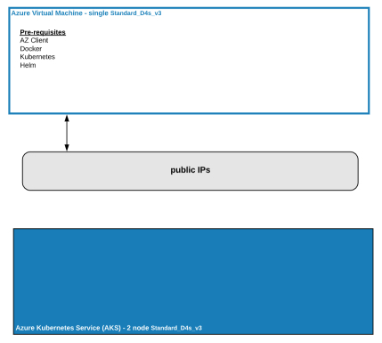
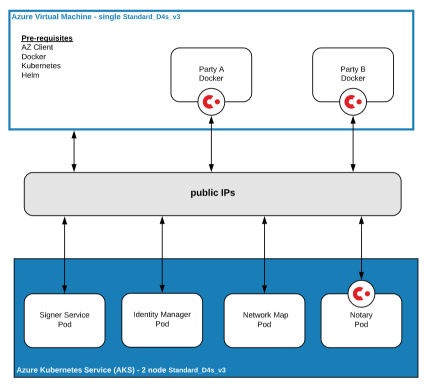
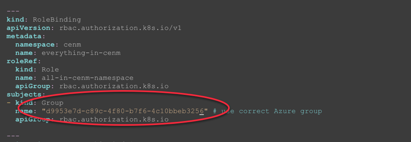
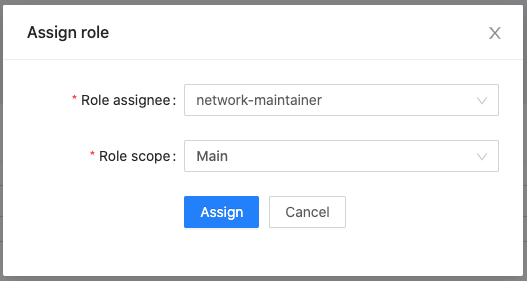
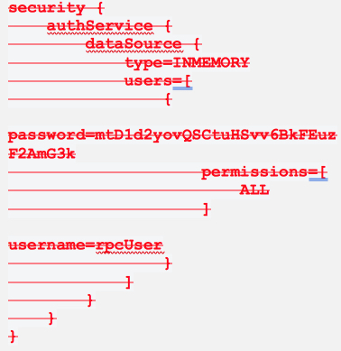
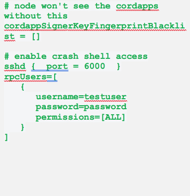

# CENM V1.5 LAB GUIDE
R3 Professional Services | 2021-05-3

# Summary

This lab guide will step you through the deployment of the Corda
Enterprise Network Manager (CENM) components and show you how to
exercise their usage.

# Objectives

In this lab you will deploy the CENM components using Helm scripts that
will drive Docker images onto a Kubernetes cluster. You will then
exercise the CENM components by registering Corda nodes. Summarizing a
list of objectives here:

* Learn how to deploy CENM using Helm

* Learn how to configure for auto-signing CSR

* Learn how to access CENM components running as Kubernetes pods

* Learn how to use CENM by registering a Corda node

  Starting Lab Environment | Resulting Lab Environment
  ------------------------ | -------------------------
   | 

# Pre-requisites

1. Pre-provisioned VM Standard\_D4s\_v3

2. Pre-provisioned Azure Kubernetes Service (AKS)

3. On client VM: Pre-installed Azure CLI (ref:
    <https://docs.microsoft.com/en-us/cli/azure/install-azure-cli-apt?view=azure-cli-latest>)

4. On client VM: Pre-installed Docker

5. On client VM: Pre-installed Kubernetes client

6. Pre-installed Helm

Note: 

# Summary of Activities

[A. Prepare the Azure Environment](Prepare)

[B. Get and Explore the CENM Deployment scripts](Explore)

[C. Deploy CENM using Docker, Kubernetes and Helm](Deploy)

[D. Use CENM by Registering Nodes](Use)

[E. Stretch Goal -- Register Another Node and Transact](Stretch)

# Activities

## A. <a name="Prepare"> Prepare the Azure Environment </a>

1. From your laptop computer ssh into the virtual machine
2. Login to Azure to azure via the “az” command line interface (cli) to ensure valid credentials.
   ```
        $ az login
   ```
   Note: If you haven’t logged into the az-cli you will get an error message, e.g.,
   ```
        Operation failed with status: 'Bad Request'. Details: The credentials in ServicePrincipalProfile were invalid. …
   ```
3. Create an azure resource group (RG) using the az-cli.
   > **_NOTE:_** this step was already completed for you. Your instructor will provide the RG name.

4. Create an Azure Kubernetes Service (AKS) cluster.
   > **_NOTE:_** this step was already completed for you with a 2-node cluster using Azure Standard_D4s_v3 virtual machines.
Your instructor will assign an AKS cluster for you to continue.

5. Connect to the newly created cluster.
   ```
        $ az aks get-credentials --resource-group <rg name> --name <your assigned aks cluster name>
        Merged "workshop-cluster" as current context in /Users/<user id provided>/.kube/config
   ```
6. Validate that the cluster has been deployed and accessible.
   ```
        $ kubectl get nodes
        NAME                                STATUS   ROLES   AGE   VERSION
        aks-nodepool1-25592043-vmss000000   Ready    agent   31m   v1.15.10
        aks-nodepool1-25592043-vmss000001   Ready    agent   31m   v1.15.10
   ```

## B. <a name="Explore"> Get and Explore the CENM Deployment scripts </a>

7. From your home directory, clone the github repo to access the CENM v1.5 deployment scripts.
   ```
        $ git clone https://github.com/corda/cenm-deployment
        Cloning into 'cenm-deployment'...
        remote: Enumerating objects: 80, done.
        remote: Counting objects: 100% (80/80), done.
        remote: Compressing objects: 100% (52/52), done.
        remote: Total 80 (delta 26), reused 77 (delta 26), pack-reused 0
        Receiving objects: 100% (80/80), 22.33 KiB | 4.47 MiB/s, done.
        Resolving deltas: 100% (26/26), done.
   ```

   Checkout to v1.5 & Change directory to cenm-deployment/k8s and list the files.
   ```
        $ git checkout v1.5
        $ cd cenm-deployment/k8s
        $ ls -la
        total 28
        drwxr-xr-x  4 myusername  staff  128 Apr  9 10:07 .
        drwxr-xr-x  5 myusername  staff  160 Apr  9 10:07 ..
        -rw-r--r--  1 myusername  staff  908 Apr  9 10:07 cenm.yaml
        drwxr-xr-x  9 myusername  staff  288 Apr  9 10:07 helm
   ```
8. Open, review, and update cenm.yaml with the object id from your Azure group id as provided by your instructor.
Notice the references to the namespace: cenm. We will address this in the next step.


9. Change directory to helm. Here you will find the folders representing each component that will be deployed with helm:

   Directory | Helm charts for:
   --------- | ----------------
   idman | Identity manager
   idman-ip | setting IP addresses for CENM components: Identity Manager, Network Map and Signer
   nmap | Network map
   notary | Notary
   notary-ip | notary-ip
   signer | signer-services

   Within each directory there will be the Chart and values yaml files, and a folder “files” containing the driver scripts and the component’s configuration file. It is the values.yaml files that contain the important configuration elements that drive the deployment. Open and explore the content of idman and notary.

   For example, change the directory to signer/files, i.e.,
   `cd signer/files` and open signer.conf, i.e., `cat signer.conf`

   Notice in the section “Signing tasks to be run (manually or scheduled)” that both CSR (as well as CRL) are set as “schedule” with an interval associated with a parameter substitution.

   ```
        ###################################################
        # Signing tasks to be run (manually or scheduled) #
        ###################################################
        signers = {
            "CSR" = {
                type = CSR
                signingKeyAlias = "cordaidentitymanagerca"
                serviceLocationAlias = "identity-manager"
                crlDistributionPoint = "http://{{ required "Public IP address required (add --set idmanPublicIP=x.x.x.x to your helm command)" .Values.idmanPublicIP }}:{{ .Values.idmanPort }}/certificate-revocation-list/doorman"
                validDays = 7300 # 20 year certificate expiry
                schedule {
                    interval = {{ .Values.signers.CSR.schedule.interval }}
                }
            },
            "CRL" = {
                type = CRL
                signingKeyAlias = "cordaidentitymanagerca"
                serviceLocationAlias = "revocation"
                crlDistributionPoint = "http://{{ required "Public IP address required (add --set idmanPublicIP=x.x.x.x to your helm command)" .Values.idmanPublicIP }}:{{ .Values.idmanPort }}/certificate-revocation-list/doorman"
                # updatePeriod = 86400000 # 1 day CRL expiry
                updatePeriod = 604800000 # 1 week CRL expiry
                schedule {
                    interval = {{ .Values.signers.CRL.schedule.interval }}
                }
    ```
   Now change directory up one level, i.e., ```cd ..``` and open values.yaml, i.e., ```cat values.yaml```
   Notice in stanza containing the CSR interval that will be substituted into the signer.conf file by the helm script. It’s set for 1 minute.

   Notice how these values associate with the variable you viewed in the signer.conf file.
   ```
        signers:
          CSR:
            schedule:
              interval: 1m
   ```
   Let’s change this to “7m” to give us a little more time to learn to manually sign a CSR before it automatically signs it.  Make a backup copy of values.yaml, i.e.,

   ```
        cp values.yaml values.yaml.orig
   ```

   Use nano (or vim if comfortable with it) to edit values.yaml and change the CSR interval to “7m”.
   ```
        nano values.yaml
   ```

   ```
        signers:
          CSR:
            schedule:
              interval: 7m
   ```

   Type ctl+x to exit and you will be prompted with Y or N to save the file.


## C. <a name="Deploy"> Deploy CENM using Docker, Kubernetes and Helm </a>

11. Change directory back to the “k8s” folder and set the default context to point to a cenm namespace to align with the cenm.yaml file.
This sets us up to run the bootstrap script.
    ```
        $ kubectl apply -f storage-class-azure.yaml
        $ kubectl apply -f cenm.yaml  
        $ export nameSpace=cenm
        $ kubectl config set-context $(kubectl config current-context) --namespace=${nameSpace}
        $ kubectl get ns
        NAME              STATUS   AGE
        cenm              Active   19d
    ```
12. Change directory to helm and run the bootstrap.cenm script.
Note the reference from kubectl to the proper namespace, cenm.
This should take no more than 5-10 minutes. If it takes more than 10 minutes something is wrong.
    ```
        $ cd helm
        $ ./bootstrap.cenm --ACCEPT_LICENSE Y
        CORDA ENTERPRISE NETWORK MANAGER – SOFTWARE EVALUATION LICENSE AGREEMENT has been accepted, CORDA ENTERPRISE NETWORK MANAGER will now continue.
        The Software Evaluation License Agreement for this product can be viewed from https://www.r3.com/corda-enterprise-network-manager-evaluation-license.
        A copy of the Software Evaluation License Agreement also exists within the /license directory in the container.
        
        Your current kubectl context:
        
        kubectl config context: workshop-cluster
                     namespace: cenm
        
        Do you want to continue ? (y/n) y
        .
        .
        .
    ```
13. While that is running, you may wish to open a new terminal session on your laptop by ssh to the same VM and check the status of helm and pods as they are deployed:
`helm list`

    ```
        $ helm list
        NAME     	NAMESPACE	REVISION	UPDATED                             	STATUS  	CHART          	APP VERSION
        idman    	cenm     	1       	2020-04-08 13:20:12.200798 -0400 EDT	deployed	idman-1.0.0    	1.5        
        idman-ip 	cenm     	1       	2020-04-08 13:18:48.355013 -0400 EDT	deployed	idman-ip-1.0.0 	1.5        
        nmap     	cenm     	1       	2020-04-08 13:20:52.756903 -0400 EDT	deployed	nmap-1.0.0     	1.5        
        notary   	cenm     	1       	2020-04-08 13:20:50.702036 -0400 EDT	deployed	notary-1.0.0   	1.5        
        notary-ip	cenm     	1       	2020-04-08 13:18:49.917686 -0400 EDT	deployed	notary-ip-1.0.0	1.5        
        signer   	cenm     	1       	2020-04-08 13:20:10.395559 -0400 EDT	deployed	signer-1.0.0   	1.5
    ```

    Next to check if the pods are running, `kubectl get pods -o wide`,
    ````
        $ kubectl get pods -o wide
        NAME                      READY   STATUS    RESTARTS   AGE   IP            NODE                       NOMINATED NODE   READINESS GATES
        idman-5df5c9c6fc-8bmfm    2/2     Running   0          20d   10.244.0.10   aks-nodepool1-27303011-0   <none>           <none>
        nmap-c7db54956-njkz5      2/2     Running   0          20d   10.244.0.13   aks-nodepool1-27303011-0   <none>           <none>
        notary-77c9545754-26lcv   2/2     Running   1          20d   10.244.0.12   aks-nodepool1-27303011-0   <none>           <none>
        signer-78674cd785-v2qx5   2/2     Running   0          20d   10.244.0.11   aks-nodepool1-27303011-0   <none>           <none>
    ````
    
14. A successful deployment returns console information about ssh addresses for each component as well as the public ip addresses to the important Identity Manager (aka “Doorman”) and Network Map that you will need to register Corda Nodes.
    ```
        CENM endpoint to connect using CENM CLI tool: 20.198.215.243:8080

        Please use this snippet in your node.conf to register Corda nodes:

        networkServices {
            doormanURL="http://20.198.209.167:10000"
            networkMapURL="http://20.44.233.235:10000"
        }

        To display the above data again run ./bootstrap.cenm.connections -p cenm 
    ```
    

15. Assigning permissions to users

Login to web application `http://<GATEWAY-SERVICE-IP>:8080/admin` using admin user and credentials as provided in below table. The CENM network has no permissions assigned to Main Zone by default, you need to assign them manually.

Get the Gateway-Service-Ip using command:
```bash
echo $(kubectl get svc --namespace cenm cenm-gateway --template "{{ range (index .status.loadBalancer.ingress 0) }}{{.}}{{ end }}"):8080
```


Login via the admin credentials:

| Username | Password |
| -------- | -------- |
| admin    | p4ssWord |

Go to **User Administration** -> **Roles** then edit **NetworkMaintainer**.



Under **Permissions**, click **Add New**. Add the following permissions:

| Permission                | Effect |
| ------------------------- | ------ |
| CENM/Signer/SignCsrs      | ALLOW  |
| CENM/Signer/GetCsrs       | ALLOW  |

**Save** your changes.


15. Network operations
Use the CENM Command Line Interface (CLI) Tool to access the Gateway Service from your local machine. To start the CENM CLI Tool, run Docker command starting a Docker container with the tool:

> **_NOTE:_** Ensure that you have the docker image downloaded locally. Try running command: `docker pull corda/enterprise-cenm-cli:1.5.0-zulu-openjdk8u242` to download the image locally

```
    docker run  -it --env ACCEPT_LICENSE=Y --name=cenm-cli corda/enterprise-cenm-cli:1.5.0-zulu-openjdk8u242

```
The welcome message will appear:

```
CORDA ENTERPRISE NETWORK MANAGER – SOFTWARE EVALUATION LICENSE AGREEMENT has been accepted, CORDA ENTERPRISE NETWORK MANAGER will now continue.   The Software Evaluation License Agreement for this product can be viewed from https://www.r3.com/corda-enterprise-network-manager-evaluation-license.
A copy of the Software Evaluation License Agreement also exists within the /license directory in the container.

Type "./cenm <COMMAND>" to run CENM CLI or "./cenm -h" to display help.
cenm@5fdb0372b89b:~$

```
You can now use cemn commands from within the running Docker container:

```
    cenm context login -s -u network-maintainer -p p4ssWord http://<GATEWAY-SERVICE-IP>:8080
```
The output should look like:

```
Login to http://<GATEWAY-SERVICE-IP>:8080 was successful and stored.

```


15. Troubleshooting, what could go wrong?
    * Incorrect namespace
    * Insufficient access to k8s cluster
    * Incorrect or insufficient access to the docker repository
    * Insufficient memory to run the components
    * kubectl command error – duplicate name

    Helpful checks:

    check for | using command
    --------- | -------------
    Helm status | ```helm list```
    K8s pod status | ```kubectl get pods -o wide```
    K8s service status | ```kubectl get svc```
    … and its details | ```kubectl describe svc <svc name>```
    K8s namespace | ```kubectl get ns```

    Example, long-running bootstrap.

    a) Run ```kubectl get svc``` to see what the service are running and their status.

    ```
        $ kubectl get svc -o wide
        NAME        TYPE           CLUSTER-IP     EXTERNAL-IP   PORT(S)                          AGE    SELECTOR
        idman-ip    LoadBalancer   10.0.212.211   <pending>     10000:32673/TCP,2222:31047/TCP   138m   app.kubernetes.io/instance=idman,app.kubernetes.io/name=idman,app.kubernetes.io/part-of=cenm,app.kubernetes.io/version=1.5
        notary-ip   LoadBalancer   10.0.146.241   <pending>     10002:31042/TCP,2222:32078/TCP   138m   app.kubernetes.io/instance=notary,app.kubernetes.io/name=notary,app.kubernetes.io/part-of=cenm,app.kubernetes.io/version=1.5
    ```
    b) Run ```kubectl describe svc <svc name>```, e.g., idman-ip
    Notice error code 401, and the statement about an invalid client secret.
    There was an invalid group id specified in cenm.yaml.
    ```
        $ kubectl describe svc idman-ip
        Name:                     idman-ip
        Namespace:                cenm
        Labels:                   app.kubernetes.io/instance=idman-ip
                                  app.kubernetes.io/managed-by=Helm
                                  app.kubernetes.io/name=idman-ip
                                  app.kubernetes.io/part-of=cenm
                                  app.kubernetes.io/version=1.5
                                  helm.sh/chart=idman-ip-1.0.0
        Annotations:              <none>
        Selector:                 app.kubernetes.io/instance=idman,app.kubernetes.io/name=idman,app.kubernetes.io/part-of=cenm,app.kubernetes.io/version=1.5
        Type:                     LoadBalancer
        IP:                       10.0.212.211
        Port:                     main  10000/TCP
        TargetPort:               10000/TCP
        NodePort:                 main  32673/TCP
        Endpoints:                <none>
        Port:                     ssh  2222/TCP
        TargetPort:               2222/TCP
        NodePort:                 ssh  31047/TCP
        Endpoints:                <none>
        Session Affinity:         None
        External Traffic Policy:  Local
        HealthCheck NodePort:     30199
        Events:
          Type     Reason                Age                    From                  Message
          ----     ------                ----                   ----                  -------
          Normal   EnsuringLoadBalancer  4m43s (x33 over 140m)  service-controller    Ensuring load balancer
          Warning  ListLoadBalancers     4m43s (x24 over 119m)  azure-cloud-provider  (combined from similar events): azure.BearerAuthorizer#WithAuthorization: Failed to refresh the Token for request to http://localhost:7788/subscriptions/af4f0732-dd8c-4330-a357-b9593255c3f0/resourceGroups/mc_guy-ce-netsvcs_guyk8scluster_westus2/providers/Microsoft.Network/loadBalancers?api-version=2018-07-01: StatusCode=401 -- Original Error: adal: Refresh request failed. Status Code = '401'. Response body: {"error":"invalid_client","error_description":"AADSTS7000215: Invalid client secret is provided.\r\nTrace ID: 4d079e83-0dab-4aa4-b194-058cee092200\r\nCorrelation ID: e64c8f71-b971-4ae8-ab8d-5c5ee11f7d5d\r\nTimestamp: 2020-04-07 16:28:05Z","error_codes":[7000215],"timestamp":"2020-04-07 16:28:05Z","trace_id":"4d079e83-0dab-4aa4-b194-058cee092200","correlation_id":"e64c8f71-b971-4ae8-ab8d-5c5ee11f7d5d","error_uri":"https://login.microsoftonline.com/error?code=7000215"}
    ```
    c) Cancel the bootstrap command (ctl-c), address the problem and clean-up with ```helm delete```.
    ```
        helm delete nmap notary idman signer notary-ip idman-ip
    ```
    d) Double-check your k8s namespace context and re-run the bootstrap.cenm from the helm directory.
    ```
        $ kubectl get ns
        NAME              STATUS   AGE
        cenm              Active   19d

        $ ./boostrap.cenm
    ```
    Example kubectl command responding with duplicate name.
    ```
        $ kubectl get pods -o wide
        error: error loading config file "/Users/myusername/.kube/config": error converting *[]NamedContext into *map[string]*api.Context: duplicate name
    ```
    Remove the config file and re-run the ```az aks get-credentials``` command.
    ```
        $ rm -r ~/.kube
        $ az aks get-credentials --resource-group <rg name> --name <your assigned aks cluster name>

        Merged "<your assigned aks cluster name>" as current context in /Users/myusername/.kube/config
    ```

## D. <a name="Use"> Use CENM by Registering Nodes </a>
16. In preparation for registering a node or two. Change back to your home directory cd ~ and make additional directories that representing the mount points for the Node’s docker container.
    ```
        # create directories as mount points for the container
        mkdir -p partya/certificates
        mkdir -p partya/config
        mkdir -p partya/persistence
        mkdir -p partya/logs
        mkdir -p partya/cordapps
    ```
        Changed directories into the node directory, e.g., partya.
    ```cd partya```

17. In order to register a node you need the network-root-truststore.jks file. You can get this from the signer service.
You will need to first find the pod name of the signer.
    ```
        $ kubectl get pods -o wide
        NAME                      READY   STATUS    RESTARTS   AGE   IP            NODE                       NOMINATED NODE   READINESS GATES
        idman-5df5c9c6fc-8bmfm    2/2     Running   0          12d   10.244.0.10   aks-nodepool1-27303011-0   <none>           <none>
        nmap-c7db54956-njkz5      2/2     Running   0          12d   10.244.0.13   aks-nodepool1-27303011-0   <none>           <none>
        notary-77c9545754-26lcv   2/2     Running   1          12d   10.244.0.12   aks-nodepool1-27303011-0   <none>           <none>
        signer-78674cd785-v2qx5   2/2     Running   0          12d   10.244.0.11   aks-nodepool1-27303011-0   <none>           <none>
    ```
    Using kubectl copy the network-root-truststore.jks from the signer pod to your newly created certificates directory.
    ```
        $ kubectl cp cenm/<signer-pod>:DATA/trust-stores/network-root-truststore.jks certificates/network-root-truststore.jks -c main
    ```
18. Download the sample Finance cordapp files (contracts and workfows) from Corda binary repository.
    ```
        cd cordapps
        curl -O https://software.r3.com/artifactory/corda/net/corda/corda-finance-contracts/4.4/corda-finance-contracts-4.4.jar
        curl -O https://software.r3.com/artifactory/corda/net/corda/corda-finance-workflows/4.4/corda-finance-workflows-4.4.jar
    ```
19. Find out from the instructor the public address for the virtual machine you are using. It should be the one you used to ssh from your laptop.

20. Go back to your partya directory. 
Using nano (or vim) create a new file named reg-partya.sh with the following contents, substituting in your VM address, and the ip address:port for both the Network Map and the Doorman.
    ```
        #!/bin/sh
        docker run -ti --net="host" \
            -e MY_LEGAL_NAME="O=PartyA, L=New York, C=US" \
            -e MY_PUBLIC_ADDRESS="<find your vm address>" \
            -e NETWORKMAP_URL="http://<find the Network Map ip:port>" \
            -e DOORMAN_URL="http://<find the Doorman ip:port>" \
            -e NETWORK_TRUST_PASSWORD="trust-store-password" \
            -e MY_EMAIL_ADDRESS="cordauser@r3.com" \
            -e ACCEPT_LICENSE="YES" \
            -v /home/azureuser/partya/config:/etc/corda          \
            -v /home/azureuser/partya/certificates:/opt/corda/certificates \
            corda/corda-zulu-java1.8-4.8:latest config-generator --generic --exit-on-generate
    ```
    > **_NOTE:_** Do take note that all the paths are absolute, so make sure you enter the right paths to the corresponding folders
    
    Ensure your new shell script has execute permissions.
    `sudo chmod ug+x reg-partya.sh`

21. Run the shell script to register your node. If your shell script has the proper values it should connect to your Identity Manager with a CSR request.
    ```
        $ ./reg-partya.sh
    ```
    ```
            -----BEGIN CERTIFICATE REQUEST-----
            MIIBMTCBzgIBADAzMQswCQYDVQQGEwJVUzELMAkGA1UEBwwCTkoxFzAVBgNVBAoM
            DkFubmllQ29udGFpbmVyMFkwEwYHKoZIzj0CAQYIKoZIzj0DAQcDQgAEU1ZmBQId
            DVS+/cHpDDLnSZUTtA9SLd92HraEIZ7KaGBV1UAWAkgU5ZnbWG7jBHFsJjOUEThe
            XCvyrX8Okcn6YaA5MBEGCisGAQQBg4piAQExAwIBBDAkBgkqhkiG9w0BCQExFwwV
            YW5uaWVDb250YWluZXJAcjMuY29tMBQGCCqGSM49BAMCBggqhkjOPQMBBwNIADBF
            AiB3UDgTiSd1F7RHUujkC1a0KE9Rysm7tW+ygncIGSh1SgIhAIB7sAv7Pdjc3fxY
            +Aa9Jp0AP70SrmOBSQONsycNqr3W
            -----END CERTIFICATE REQUEST-----
            Submitting certificate signing request to Corda certificate signing server.
            Successfully submitted request to Corda certificate signing server, request ID: 17D39591468AEA17884B053F077704CE60D7B605E34CEBD15767D142C759C82A.
            Start polling server for certificate signing approval.
            Certificate signing request approved, storing private key with the certificate chain.
            Private key 'cordaclientca' stored in the (file-based keystore). Certificate-chain stored in node's file-based keystore.
            Generating SSL certificate for node messaging service.
            SSL private key and certificate chain stored in /opt/corda/certificates/sslkeystore.jks.
            Generating trust store for corda node.
            Node trust store stored in /opt/corda/certificates/truststore.jks.
            ! ATTENTION: If you make use of confidential identities, there is now a more secure way of storing the associated keys, but you have to explicitly enable it with the appropriate configuration. Review the documentation to see how this can be enabled via the `freshIdentitiesConfiguration` entry. Alternatively, you can disable this warning by setting `disableFreshIdentitiesWarning` to true in the node's configuration.
            Successfully registered Corda node with compatibility zone, node identity keys and certificates are stored in '/opt/corda/certificates', it is advised to backup the private keys and certificates.
            Corda node will now terminate.
            Successfully registered with http://52.231.107.242:10000, starting corda
    ```
    > **_NOTE:_** if we have delayed auto-signing enough time this won’t complete registration until we connect to the signing service and manually sign the CSR request.

22. Sign the CSR request.
Use the CENM Command Line Interface (CLI) Tool to access the Gateway Service from your local machine. To start the CENM CLI Tool, run Docker command starting a Docker container with the tool:

> **_NOTE:_** Ensure that you have the docker image downloaded locally. Try running command: `docker pull corda/enterprise-cenm-cli:1.5.0-zulu-openjdk8u242` to download the image locally


```
    docker run  -it --env ACCEPT_LICENSE=Y --name=cenm-cli corda/enterprise-cenm-cli:1.5.0-zulu-openjdk8u242

```
The welcome message will appear:

```
CORDA ENTERPRISE NETWORK MANAGER – SOFTWARE EVALUATION LICENSE AGREEMENT has been accepted, CORDA ENTERPRISE NETWORK MANAGER will now continue.   The Software Evaluation License Agreement for this product can be viewed from https://www.r3.com/corda-enterprise-network-manager-evaluation-license.
A copy of the Software Evaluation License Agreement also exists within the /license directory in the container.

Type "./cenm <COMMAND>" to run CENM CLI or "./cenm -h" to display help.
cenm@5fdb0372b89b:~$

```
You can now use cemn commands from within the running Docker container:

```
    cenm context login -s -u network-maintainer -p p4ssWord http://<GATEWAY-SERVICE-IP>:8080
    
```

The output should look like:

```
Login to http://<GATEWAY-SERVICE-IP>:8080 was successful and stored.

```

Next, get list of pending CSRs using below command and make note of the ID in the output:

```
    cenm signer csr list

```

Next Sign the CSR using below command and pass the ID of CSR obtained from previous command:

```
    cenm signer csr sign <ID>

```


23. Check your partya directories for additional files, e.g., you should find the following in your certificates folder.
    ```
            ls -l certificates/
            total 20
            -rw-r--r-- 1 ubuntu ubuntu 1208 Apr 10 00:07 network-root-truststore.jks
            -rw-r--r-- 1 ubuntu ubuntu 6320 Apr 10 00:11 nodekeystore.jks
            -rw-r--r-- 1 ubuntu ubuntu 3517 Apr 10 00:11 sslkeystore.jks
            -rw-r--r-- 1 ubuntu ubuntu 1208 Apr 10 00:11 truststore.jks
    ```

24. Review and modify the node.conf that was generated when you ran the registration script. Note: the node.conf file a result of the Corda docker image, not the registration process.
It’s worth noting the node hasn’t actually run yet, so this is an opportunity to revisit the node.conf … several things may be beneficial to include:
    * no ssh port is available… so the node operator will not have access to the crash shell
    * no RPC users are available to login to the crash shell
    * node won’t notice cordapps without an additional entry: "cordappSignerKeyFingerprintBlacklist = []"
    * can't have rpc users stanza (which must be added) and security sections (which is available by default) together in the node.conf.

25. Using nano (or vim) edit node.conf. Remove the section in the node.conf that is marked in red strikethrough in the below “Before” section, and add the information marked in green in the below “After” section.

    Before | After
    ------ | -----
     | 

26. You may now run the node.
To do this let’s create another shell script, run-partya.sh with the following contents, substituting in your VM address, and the ip address:port for both the Network Map and the Doorman.
    ```
        #!/bin/sh
        docker run -ti \
                --memory=2048m \
                --cpus=2 \
                -v /home/azureuser/partya/config:/etc/corda \
                -v /home/azureuser/partya/certificates:/opt/corda/certificates \
                -v /home/azureuser/partya/persistence:/opt/corda/persistence \
                -v /home/azureuser/partya/logs:/opt/corda/logs \
                -v /home/azureuser/partya/cordapps:/opt/corda/cordapps \
                -p 10200:10200 \
                -p 10201:10201 \
                -p 6000:6000 \
                corda/corda-zulu-java1.8-4.8:latest
    ```
    Ensure your new shell script has execute permissions.
    `sudo chmod ug+x run-partya.sh`

27. Run the script.

    ```
        ./run-partya.sh
        
          / ____/     _________/ /___ _   
         / /     __  / ___/ __  / __ `/   
        / /___  /_/ / /  / /_/ / /_/ /    
        \____/     /_/   \__,_/\__,_/     

        --- Corda 4.8 (e7e59c8) --------------------------------------------------

        Tip: If you don't wish to use the shell it can be disabled with the --no-local-shell flag

        Logs can be found in                    : /opt/corda/logs
        ! ATTENTION: CORDA_BASE (property or environment variable) cannot be mapped to an existing Corda config property and thus won't be used as a config override! It won't be passed as a config override! If that was the intention  double check the spelling and ensure there is such config key.
        ! ATTENTION: If you make use of confidential identities, there is now a more secure way of storing the associated keys, but you have to explicitly enable it with the appropriate configuration. Review the documentation to see how this can be enabled via the `freshIdentitiesConfiguration` entry. Alternatively, you can disable this warning by setting `disableFreshIdentitiesWarning` to true in the node's configuration.
        Advertised P2P messaging addresses      : mynode.someplace.dns.com:10200
        RPC connection address                  : 0.0.0.0:10201
        RPC admin connection address            : 0.0.0.0:10202
        Loaded 2 CorDapp(s)                     : Contract CorDapp: Corda Finance Demo version 1 by vendor R3 with licence Open Source (Apache 2), Workflow CorDapp: Corda Finance Demo version 1 by vendor R3 with licence Open Source (Apache 2)
        Node for "partya" started up and registered in 22.32 sec
        SSH server listening on port            : 6000
        Running P2PMessaging loop
    ```
    The node is now running in the foreground and registered to the Kubernetes based CENM instance.

28. Stop the node with “ctrl-c”.

29. Prepare a Docker Compose file (`docker-compose.yaml`) to start/stop your node.
    ```
        version: '3.5'
        services:
            partya-node:
                networks:
                    - partya-net
                ports:
                    - "10200:10200"
                    - "10201:10201"
                    - "10202:10202"
                    - "6000:6000"
                image: corda/corda-zulu-java1.8-4.8:latest
                container_name: partya-node
                volumes:
                    - /home/azureuser/partya/config:/etc/corda
                    - /home/azureuser/partya/certificates:/opt/corda/certificates
                    - /home/azureuser/partya/persistence:/opt/corda/persistence
                    - /home/azureuser/partya/logs:/opt/corda/logs
                    - /home/azureuser/partya/cordapps:/opt/corda/cordapps
            networks:
                partya-net:
                    driver: bridge
    ```

30. Start your node `docker-compose up -d partya-node`

31. Check the logs `docker-compose logs -f`

32. From your laptop ssh into your node
`ssh -p 6000 testuser@<yourVMAddress>`
(recall from the node.conf that the testuser password is `password`)

33. Once in the node CRaSH run a series of commands to interact with it, for example:
`>> flow list`
`>> run nodeInfo`
`>> run notaryIdentities`

## E. <a name="Stretch"> Stretch Goal -- Register Another Node and Transact </a>

TBD
This section will ask the student to add another node based on following instructions of prior section. Then they can run a flow transaction between their two nodes.
